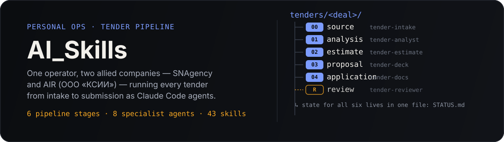

<p align="center">
  
</p>

<p align="center">
  <sub>Private business-ops repo · not a public product · one operator, two allied companies</sub>
</p>

## What this is

One person runs the full tender and proposal lifecycle for two allied companies — **SNAgency** (ООО «Агентство «Социальные Сети»») and **AIR** (ООО «КСИИ») — as PM, BA, marketer, designer, presale, and tender writer at once. This repo is the versioned system behind that: an entry protocol every agent reads first (`AGENTS.md`), a staged pipeline that turns "someone sent us a tender" into a submitted bid, a memory system so decisions and prices survive between sessions, and a role-based skill library for everything that isn't tender-specific.

An agent that opens this repo starts with no memory of past conversations. The structure is what lets it pick up mid-pipeline anyway — read `AGENTS.md`, find the tender's `STATUS.md`, know exactly what stage it's at and what's already decided.

## How a tender moves through the system

Every tender lives in its own folder under `tenders/`, and the folder structure *is* the process — one stage, one subfolder. `STATUS.md` is read first and updated after every stage; it's the memory that lets an agent resume a tender it has never seen before.

| Stage | Folder | Agent | Produces |
| --- | --- | --- | --- |
| 0 · Intake | `00-source/` | `tender-intake` | Tender folder + `STATUS.md` + source inventory |
| 1 · Analysis | `01-analysis/` | `tender-analyst` | Bid / no-bid conclusion, with reasoning |
| 2 · Estimate | `02-estimate/` | `tender-estimate` | Internal cost breakdown + client-facing price |
| 3 · Proposal | `03-proposal/` | `tender-deck` | The КП / deck itself (HTML → PDF) |
| 4 · Application | `04-application/` | `tender-docs` | Filled forms, submission checklist |
| R · Review | *(cross-cutting)* | `tender-reviewer` | A list of violations — it fixes nothing itself |

Stage R isn't part of the linear order — it's called after any of stages 2–4, whenever an artifact is about to be shown to a client or a human. The full process, including how a change at one stage ripples into the others, is written out in `tenders/PROCESS.md`.

## Memory: the system's long-term state

Agents restart cold every session, so anything that should outlive a conversation has to live in a file, not in chat history:

| What | Where |
| --- | --- |
| Rules that apply to every deal (pricing discipline, house style) | `memory/rules.md` |
| Legal entities, contacts, portfolio | `memory/company.md` |
| Pricing parameters and rate cards | `memory/pricing.md` |
| Dated decision log | `memory/log.md` |
| One tender's own facts and decisions | `tenders/<deal>/STATUS.md` |

If a fact in `memory/` ever contradicts a skill's description of *how* to do something, `memory/` wins — skills describe method, memory describes current reality.

## Skill library

Everything that isn't tender-specific — BA documents, design work, market research, sales conversations — is a Claude Code skill, sorted by the role that uses it:

| Role | Folder | Handles |
| --- | --- | --- |
| Tender / Proposal | `tenders/` | КП builders, RFP/RFI response, price justification |
| Business Analyst | `business-analysis/` | BRDs, FRS, use cases, user stories, acceptance criteria, process/data-flow diagrams |
| Web/Frontend Designer | `design/` | landing pages, UI polish, motion, README/asset design, animation review |
| CMO / Marketing | `marketing/` | competitor profiling, customer research, positioning, product copy |
| Presale / Sales | `sales/` | discovery calls, objection handling |
| Shared | `shared/` | research, skill discovery, browser automation, cross-role utilities |
| Product Manager | `product-management/` | reserved — not populated yet |
| Project Manager | `project-management/` | reserved — not populated yet |

Every folder under a role is one skill: a self-contained directory with a `SKILL.md` declaring its `name` and `description`. Skill names are unique across the whole tree, because the installer flattens everything into one runtime folder.

```text
public agent-skills repo  →  skills/<role>/<name>/  →  ~/.claude/skills/<name>/
        (found via              (versioned,               (what Claude Code
      find-skills skill)         backed up here)              runs from)
```

1. The `find-skills` skill searches the open skills ecosystem (skills.sh / `npx skills`) for a candidate that solves a real, recurring need in one of the roles above.
2. Once it proves useful, its folder is copied into the matching `skills/<role>/` directory here — that's the versioning and backup step.
3. `scripts/install-skills.sh` syncs everything from `skills/` into the live `~/.claude/skills/` runtime folder.

## Quickstart

```bash
git clone https://github.com/Ejokey/AI_Skills.git
cd AI_Skills
./scripts/install-skills.sh
```

Restart Claude Code, then either invoke a skill directly by name ("use brd-creation to draft a BRD for this feature") or drop tender documents into a session and let the pipeline take it from `tender-intake`.

To pull in a change made directly under `~/.claude/skills`, or after a `git pull`, just re-run the script — it wipes and replaces each matching folder, so it's safe to run any time skills drift out of sync:

```bash
git pull
./scripts/install-skills.sh
```

## Conventions

- `AGENTS.md` is the entry point — any agent reading this repo reads it first, before touching a tender or a skill.
- One folder = one skill; every skill folder has a `SKILL.md` with `name` + `description` frontmatter. Names are unique across the whole tree — the installer is flat, so a collision in two roles silently overwrites one.
- One tender = one folder under `tenders/`, named after the deal. `00-source/` is never edited — it's the record of what actually arrived.
- Agents don't invent prices, scope, deadlines, or commercial terms. If a number is needed and no one supplied it, the agent asks — it doesn't guess and it doesn't leave a silent placeholder.
- `projects/` holds one folder per client or non-tender initiative — context, working docs, outputs. It's excluded from this README because it's working material, not the system itself.
