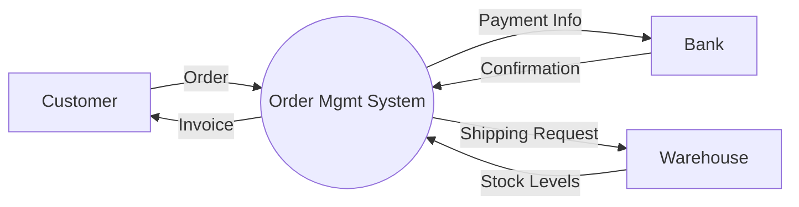

# Data Flow Diagrams (DFD) Skill

## Purpose
Visualize how data moves through a system. DFDs show *what* the system does with data, unlike Flowcharts which show control flow (sequence).

## When to Use
- Understanding legacy systems.
- Analyzing data privacy (where does PII go?).
- Designing integrations.
- Security auditing (identifying trust boundaries).

## DFD Notation (Gane & Sarson or Yourdon)

1.  **Process (Circle/Rounded Rect)**: Transforms data.
    - Format: Verb + Noun.
    - Example: `Calculate Tax`, `Validate User`.
2.  **External Entity (Square)**: Source or Sink of data (Outside scope).
    - Example: `Customer`, `Bank API`, `Admin`.
3.  **Data Store (Open Rectangle/Parallel Lines)**: Resting data.
    - Example: `Customer DB`, `Orders File`.
4.  **Data Flow (Arrow)**: Movement of data packets.
    - Label: `Order Details`, `Invoice`.

## DFD Levels

### Level 0: Context Diagram
**Scope**: Entire System as ONE process.
**Shows**: System boundary and interaction with external world.

**Example**:

*Note: NO data stores are shown in Level 0 unless shared with external systems.*

### Level 1: System Breakdown
**Scope**: Breaks the "One Process" into major sub-processes (3-7 bubbles).
**Shows**: Data stores used by these processes.

**Example**:
1.  **Process 1.0**: Validate Order
    - Input: Order (from Customer)
    - Output: Valid Order
2.  **Process 2.0**: Calculate Total
    - Input: Valid Order + Price (from Product DB)
    - Output: Total Amount
3.  **Process 3.0**: Process Payment
    - Input: Total + Card Info
    - Output: Receipt

## Methodology Rules
1.  **Conservation of Data**: A process cannot create data from nothing (must have input). A process cannot consume data without output (black hole).
2.  **No Direct Connections**:
    - Entity ↔ Entity (Out of scope)
    - Entity ↔ Data Store (Must go through a process)
    - Data Store ↔ Data Store (Must go through a process)
3.  **Labeling**: All arrows must be labeled with the *data* moving (not the action).

## DFD vs. Flowchart

| DFD | Flowchart |
|-----|-----------|
| Data Focus | Control/Sequence Focus |
| "Calculate Tax" | "If Tax > 0 Then..." |
| No Looping/Branching | Has Loops/Decisions |
| Parallel/Async implied | Sequential implied |

## Creating a DFD in Steps
1.  **Identify Entities**: Who sends/receives data? (Customer, Manager, API).
2.  **Identify Processes**: What logical actions happen? (Check inventory, Save user).
3.  **Identify Data Stores**: Where is info kept? (Files, Tables).
4.  **Draw Level 0**: Connect Entities to "The System".
5.  **Explode to Level 1**: Break system into sub-processes.
6.  **Verify**: Check for data conservation and missing flows.

## Best Practices
- Keep it logical: Don't worry about physical implementation (e.g., "Paper file" vs "SQL DB" is irrelevant for logical DFD).
- Number processes: 1.0, 2.0, 3.0. Sub-processes: 1.1, 1.2.
- Limit complexity: If a level has > 7 processes, decompose further (Level 2).

## Tools
- Visio.
- Lucidchart.
- Draw.io.
- Mermaid (Graph style).
