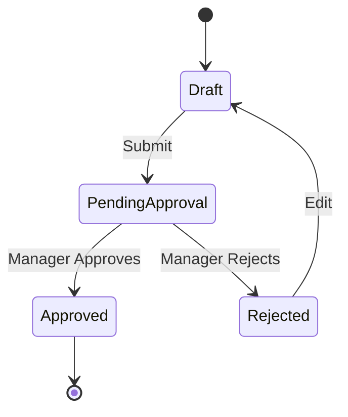
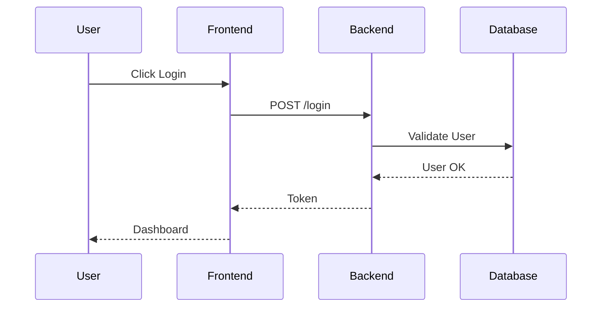

# Requirements Modeling Skill

## Purpose
Use visual models to clarify and analyze requirements. "A picture is worth 1000 words" - specifically for complex logic and relationships.

## When to Use
- Complex logic (State diagrams).
- System interactions (Sequence diagrams).
- Data relationships (Class/ERD diagrams).
- User decisions (Activity diagrams).

## Key Modeling Techniques (UML & Others)

### 1. State Machine Diagram (State Transition)
**Use**: Object has a complex lifecycle (e.g., Order Status).
**Elements**: States (Rounded Rect), Transitions (Arrows), Events/Triggers.

**Example**:

### 2. Sequence Diagram
**Use**: Interaction between systems or objects over time.
**Elements**: Participants (Lifelines), Messages (Arrows).

**Example**:

### 3. Activity Diagram
**Use**: Workflow logic (similar to Flowcharts but supports parallelism).
**Elements**: Activities, Decisions, Forks/Joins.

### 4. Class Diagram
**Use**: Conceptual data modeling (Object-Oriented).
**Elements**: Class boxes (Name, Attributes, Operations).

### 5. Decision Tables
**Use**: Complex business rules with many conditions.
**Format**: Conditions vs. Actions.

| Condition: Age < 18 | Y | Y | N | N |
| Condition: Member | Y | N | Y | N |
| **Action: Discount**| 50% | 20% | 10% | 0% |

## Best Practices
- **Model for Audience**: Don't show a Sequence Diagram to a marketing VP. Use Flowcharts for business, UML for devs.
- **Keep it Simple**: Break complex diagrams into smaller views.
- **Validate with Code**: Ensure the model matches reality (or feasible reality).
- **Annotate**: Add notes to explain "Why".

## Tools
- **Mermaid**: Text-to-diagram (Great for docs).
- **PlantUML**: Standard text-based UML.
- **Lucidchart / Visio**: Visual drag-and-drop.
- **Figma**: Good for high-level flows.
